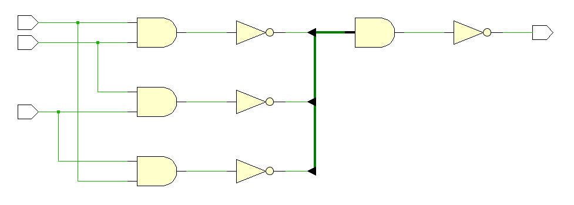

# Voter_VHDL
 A voter using VHDL

This project consist in two parts, a voter bit by bit, and an update of this with a bit vector voter 
with an error signal in case of non-matching signal (delete in case of no use).

